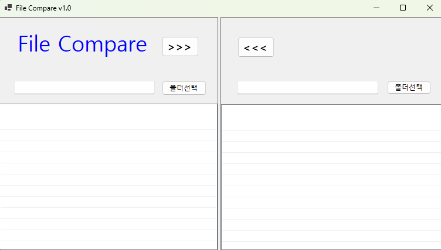
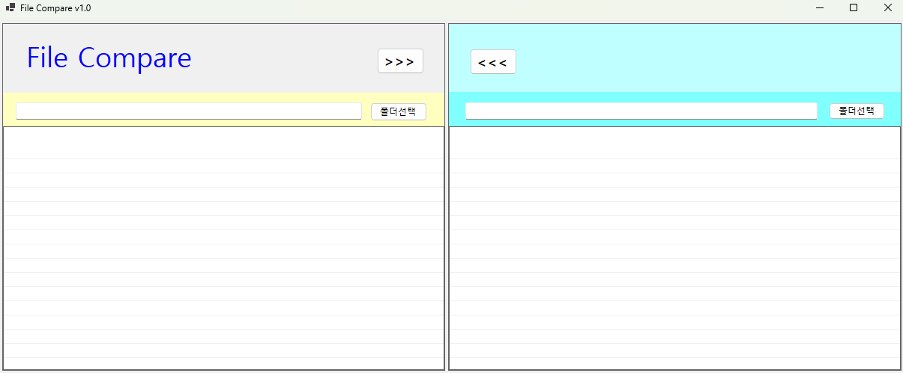

# # (C# 코딩 7주차) 파일 비교 툴 (File Compare) 구현
***-- 22017004 컴퓨터 SW 강희준 --***

## 📑 개요: C# 프로그래밍 학습
- 두 폴더의 파일 목록을 비교하고, 최신 파일을 상호 복사하여 관리하는 파일 동기화 툴 구현

### 🛠 사용한 플랫폼
- **Language & Framework:** C#, .NET Windows Forms
- **IDE:** Visual Studio 2022
- **Version Control:** GitHub

### 🏗 사용한 컨트롤
- **목록 표시:** ListView (파일 이름, 크기, 수정일 표시 및 색상 구분)
- **입력창:** TextBox (선택된 폴더 경로 표시)
- **상호작용:** Button (폴더 선택, 파일 복사 `>>>`, `<<<`)
- **다이얼로그:** FolderBrowserDialog (시스템 폴더 선택창)
- **이미지:** ImageList (ListView 아이콘 연결)

### 💻 사용한 기술 및 개념
- **파일 및 디렉토리 관리:** `DirectoryInfo`와 `FileInfo` 클래스를 활용해 파일 시스템 데이터 추출.
- **데이터 비교 로직:** 파일명과 최종 수정 시간(`LastWriteTime`)을 비교하여 파일의 상태(동일, New, Old, 단독) 정의.
- **파일 입출력:** `File.Copy` 메서드를 사용하여 물리적 파일 복사 및 덮어쓰기 구현.
- **재귀 알고리즘(Recursion):** 하위 폴더까지 탐색하여 모든 파일을 처리하는 재귀적 구조 설계.
- **예외 처리:** `try~catch` 구문을 통해 접근 권한이 없는 폴더나 파일 오류 시 프로그램 강제 종료 방지.

---

## 📸 과제 1: 기본 UI 배치 및 초기 설계

----------------------------------------------------------

- 과제 1 완료 화면 : anker 속성으로 창 크기 조절 시 UI가 깨지지 않도록 설정하고 패널마다 색상을 달리하여 구분하기 쉽게 디자인.

**✅ 과제 내용**
- 파일 비교를 위한 좌우 대칭형 UI 구성
- `ListView`의 View 속성을 `Details`로 설정하고 컬럼(이름, 크기, 수정일) 추가

**💡 상세 구현 내용**
- 두 개의 `ListView`를 배치하여 좌측(원본)과 우측(대상) 폴더를 한눈에 비교할 수 있게 했습니다. 

- `ColumnHeader`를 사용하여 파일의 정렬된 형태로 보여주도록 설계했습니다.

- `anker` 속성을 활용하여 창 크기 조절 시에도 각 컨트롤이 적절히 위치를 유지하도록 설정했습니다.

**🔬 분석 및 학습 포인트**
- `ListView` 컨트롤의 `Details` 모드를 활용해 다량의 데이터를 표 형태로 관리하는 법을 익힘. 

- 또한 디자인 타임에서 `Anchor` 속성을 조절하여 창 크기 조절 시 UI가 깨지지 않도록 설정.

- 패널마다 다른 배경색을 적용하여 시각적으로 구분하기 쉽게 디자인함.

---

## 📸 과제 2: 폴더 선택 및 파일 비교 (색상 구분)

**✅ 과제 내용**
- `FolderBrowserDialog`를 이용한 폴더 경로 선택 기능
- 두 폴더의 파일을 비교하여 상태에 따라 아이템 색상 변경

**💡 상세 구현 내용**
- `DirectoryInfo.GetFiles()`로 파일 목록을 가져온 후, 양쪽 폴더에 동일한 이름이 있는지 확인합니다. 
- **색상 규칙 적용:** - 동일 파일: 검은색
  - 최신 파일(New): 빨간색
  - 이전 파일(Old): 회색
  - 단독 파일: 보라색

**🔬 분석 및 학습 포인트**
- `DateTime.Compare` 또는 `LastWriteTime` 비교를 통해 논리적인 상태값을 도출하는 과정을 실습했습니다. `ListViewItem.ForeColor` 속성을 활용해 사용자에게 데이터의 차이를 시각적으로 명확히 전달하는 UX 기법을 배웠습니다.

---

## 📸 과제 3: 파일 복사 기능 구현

**✅ 과제 내용**
- `>>>` 및 `<<<` 버튼 클릭 시 선택된 폴더로 파일 복사
- 복사 완료 후 화면 실시간 갱신

**💡 상세 구현 내용**
- `File.Copy(source, dest, true)` 메서드를 사용하여 동일 이름의 파일이 있을 경우 덮어쓰기가 가능하도록 구현했습니다. `Path.Combine`을 사용하여 경로 문자열을 안전하게 생성하고, 복사가 끝나면 다시 리스트를 불러와 변경된 상태(검은색)를 확인하게 했습니다.

**🔬 분석 및 학습 포인트**
- 파일 시스템에 직접적인 영향을 주는 `System.IO` 네임스페이스의 실무 활용법을 익혔습니다. 특히 복사 전후의 데이터 상태 변화를 즉시 UI에 반영하는 실시간 업데이트 로직의 중요성을 체감했습니다.

---

## 📸 과제 4: 하위 폴더 처리 (재귀 탐색)

**✅ 과제 내용**
- 현재 폴더뿐만 아니라 하위 폴더 내의 파일까지 비교 및 복사 대상에 포함
- 재귀 함수를 이용한 폴더 트리 탐색

**💡 상세 구현 내용**
- `GetDirectories()`를 호출하여 하위 디렉토리가 존재할 경우 자기 자신을 다시 호출하는 재귀적 구조를 설계했습니다. 이를 통해 폴더 구조가 아무리 깊어도 모든 경로를 탐색하여 파일 비교를 수행할 수 있게 확장했습니다.

**🔬 분석 및 학습 포인트**
- 이론으로만 배우던 **재귀 알고리즘**이 실제 파일 시스템 탐색에서 어떻게 필수적으로 사용되는지 경험했습니다. 탐색 중 발생할 수 있는 시스템 폴더 접근 거부 문제를 `try~catch`로 해결하며 프로그램의 견고함을 높였습니다.

---

## 💡 실습 소감 및 분석
이번 7주차 실습은 파일 시스템을 직접 제어하고 복잡한 비교 로직을 시각화하는 과정을 다루었습니다. 단순히 파일을 옮기는 것을 넘어, 수정 날짜를 기준으로 데이터의 '최신성'을 판별하고 이를 색상으로 표현하는 과정에서 유용한 유틸리티 제작의 즐거움을 느꼈습니다. 특히 재귀 함수를 통해 복잡한 폴더 구조를 단순한 로직으로 풀어내는 방식이 인상 깊었으며, 앞으로 대용량 데이터를 처리할 때의 효율적인 알고리즘 설계에 대해 더 고민해 보게 되었습니다.